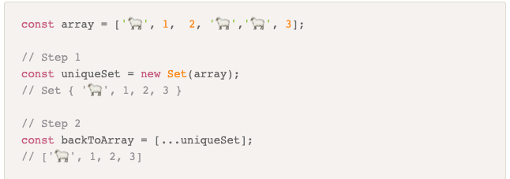

# Set


### What is a Set?
Many data structures we’ve covered are lists, or collections of ordered values (e.g., arrays).
*Sets * are like similar to arrays, with one important difference: Sets hold unique sequences of values (i.e., a value cannot occur twice in a set).

### Why Sets?
Sets have a number of useful properties.
* Sets are great for storing unique collections of items, for example
* Unique usernames in a database.
* A unique list of tags on all of your blog posts
* Customer names.
* Sets can store a wide range of data type(eg.,number, booleans, strings)
* A set won't allow you to add a value that's already present.
* Passing an arry though a set object will automatically remove any duplicates in the array.

 <a href="https://git.generalassemb.ly/software-engineering-immersive/SEI-Course-Materials/blob/master/6_computer-science-materials/data-structures/sets/exercises/Set.js" target="_blank">In-Class Exercise: Implementing a Set</a>


## JavaScript


# Using set
Set is a new data object introduced in ES6. Because Set only lets you store unique values. When you pass in an array, it will remove any duplicate values.
### Remove-Array-Duplicates-in-ES6




### Step 1 
* We are creating a new Set.
* By passing an array.
* Beacuse Set only allows unique 
* All duplicates will be removed.
```

let a = [1,2,5,2,1,8];
let bSet = new Set(a)
console.log(bSet);
// Set{1,2,5,8}

```
### Step 2
* We're going to convert it back to an array.
* by using the spread operator ...

```
console.log([...bSet]);
//[1,2,5,8]

```


---


### Set.prototype.add() 
 It adds the new element with a specified value at the end of the Set object.
Example:
```

// using Set.prototype.add(value) 
// creating an empty set 
var set1 = new Set(); 
  
// set contains 10, 20 
set1.add(10); 
set1.add(20); 
  
// As this method returns 
// the set object hence chanining  
// of add method can be done. 
set1.add(30).add(40).add(50); 
  
// prints 10, 20, 30, 40, 50 
console.log(set1);
```
---

### Set.prototype.delete()
 It deletes an element with the specified value from the Set object.
Example:

 ```
 // using Set.protoype.delete(value) 
// creating set it contains 
// f, o , d, i, e 
var set1 = new Set("foooodiiiieee"); 
  
// deleting e from the set 
// it prints true 
console.log(set1.delete('e')); 
  
// set contains f, o, d, i 
console.log(set1); 
  
// deleting an element which is  
// not in the set 
// prints false 
console.log(set1.delete('g')); 
 ```

 ---

### Set.prototype.clear() 
 It removes all the element from the set.
 Example
 ```
 // Using Set.prototype.clear() 
// creating a set 
var set2 = new Set([10, 20, 30, 40, 50]); 

// prints {10, 20, 30, 40, 50} 
console.log(set2); 

// clearing set2 
set2.clear() 

// prints {} 
console.log(set2); 

 ```

 ---


## Additional Resources
1. <a href="https://www.samanthaming.com/tidbits/43-3-ways-to-remove-array-duplicates" target="_blank">How to Remove Array Duplicates in ES6</a>
2. <a href="https://dzone.com/articles/hashset-vs-treeset-vs" target="_blank">HashSet vs. TreeSet vs. LinkedHashSet</a>
3. <a href="https://www.geeksforgeeks.org/sets-in-javascript/" target="_blank">Sets in JavaScript</a>
4. <a href="https://developer.mozilla.org/en-US/docs/Web/JavaScript/Reference/Global_Objects/Set" target="_blank">Set MDN</a>
5. <a href="https://developer.mozilla.org/en-US/docs/Web/JavaScript/Reference/Global_Objects/Sett" target="_blank">Set (abstract data type)</a>