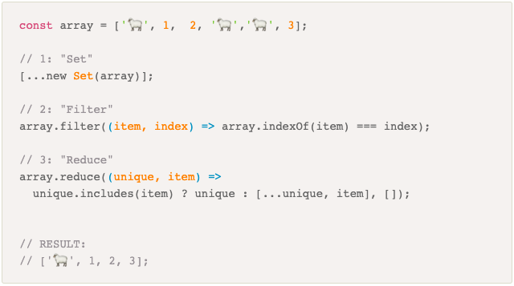

# How-to-Remove-Array-Duplicates-in-ES6

## 


---

### Step 1 
* We are creating a new Set.
* By passing an array.
* Beacuse Set only allows unique 
* All duplicates will be removed.
```

let a = [1,2,5,2,1,8];
let bSet = new Set(a)
console.log(bSet);
// Set{1,2,5,8}

```
### Step 2
* We're going to convert it back to an array.
* by using the spread operator ...

```
console.log([...bSet]);
//[1,2,5,8]

```
### Other convert Set to an Array using Array.from
* Array.from();

```
Array.from(bSet);
//[1,2,5,8]

or

Array.from(new Set(a));
//[1,2,5,8]

```


---


## Additional Resources
1. <a href="https://www.samanthaming.com/tidbits/43-3-ways-to-remove-array-duplicates" target="_blank">How to Remove Array Duplicates in ES6</a>
2. <a href="https://dzone.com/articles/hashset-vs-treeset-vs" target="_blank">HashSet vs. TreeSet vs. LinkedHashSet
</a>